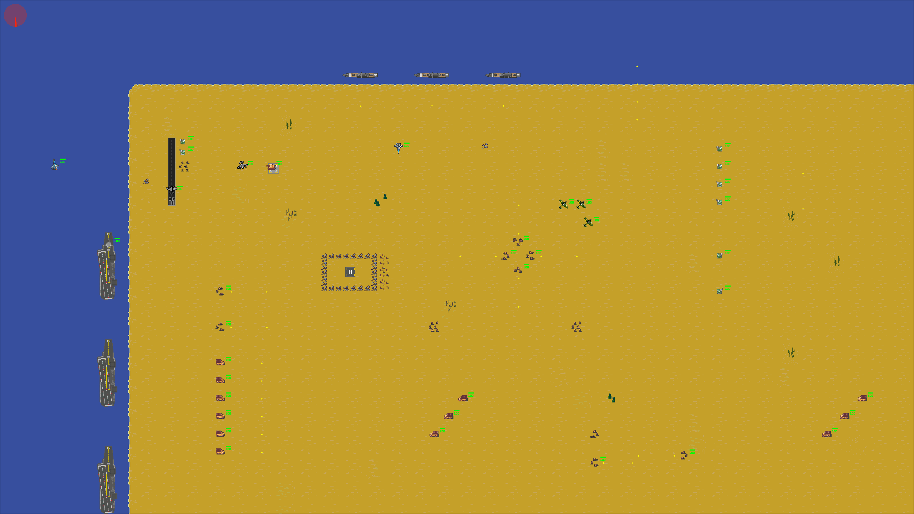

# 2D Game Engine in C++

A 2D game engine built from scratch in modern C++17 with SDL2, featuring a custom Entity Component System (ECS), Lua scripting and Dear ImGui integration.



## Features

- **Entity Component System (ECS)** with data-oriented component pools, keeping components of the same type packed together in memory
- **Event system** for decoupled communication between systems (for example, collision events)
- **Asset store** for loading and managing textures, fonts and other resources
- **Collision system**
- **Animation system** for sprite-based animations
- **Lua scripting** via Sol, so game logic and level data can be defined in scripts without recompiling
- **Dear ImGui** integration
- **Logger** for engine messages and errors

## Tech

C++17 · SDL2 (SDL2_image, SDL2_ttf, SDL2_mixer) · Lua · Sol · Dear ImGui · MinGW-w64 (MSYS2 UCRT64) · Make

## Download and play

1. Go to the [Releases](../../releases) page and download the latest `.zip`.
2. Unzip it anywhere.
3. Run `gameengine.exe`.

**Controls**

| Key | Action |
|---|---|
| Arrow keys | Change direction (the player keeps moving in the chosen direction) |
| Space | Shoot |

## Build from source (Windows)

**Requirements**

- [MSYS2](https://www.msys2.org/) with the UCRT64 environment
- Install the compiler and libraries from the MSYS2 UCRT64 terminal:

```
pacman -S mingw-w64-ucrt-x86_64-gcc mingw-w64-ucrt-x86_64-make mingw-w64-ucrt-x86_64-SDL2 mingw-w64-ucrt-x86_64-SDL2_image mingw-w64-ucrt-x86_64-SDL2_ttf mingw-w64-ucrt-x86_64-SDL2_mixer mingw-w64-ucrt-x86_64-lua
```

- Make sure `C:\msys64\ucrt64\bin` is in your `PATH`. If MSYS2 is installed somewhere else, update the SDL2 include path in the `Makefile`.

**Build and run**

```
mingw32-make build
mingw32-make run
```

| Command | What it does |
|---|---|
| `mingw32-make build` | Compiles the engine with a console window (useful for logs) |
| `mingw32-make release` | Compiles the engine without a console window |
| `mingw32-make run` | Runs `gameengine.exe` |
| `mingw32-make clean` | Deletes the executable |

## Project structure

```
src/
  Game/         Main game loop and setup
  ECS/          Entity Component System core
  AssetStore/   Resource loading and management
  Logger/       Logging utilities
libs/           Third-party libraries (Dear ImGui, Sol, ...)
assets/         Textures, fonts, sounds and scripts
```

## Architecture

The engine follows an Entity Component System design:

- **Entities** are just IDs.
- **Components** are plain data (transform, sprite, rigid body, collider, animation...) stored in contiguous pools per component type.
- **Systems** hold the logic and act on every entity that has the components they require (for example, the movement system updates all entities with a transform and a rigid body).

This keeps data and behavior separate and makes it easy to add new features by writing a new component and system without touching existing code.

## What I learned

This project taught me how to build the systems of a game engine from scratch instead of relying on an existing engine. Designing the ECS, event system and asset store gave me a much clearer understanding of engine architecture and of how the pieces I use every day in Unity fit together underneath. It also significantly improved my C++ knowledge.

## Credits

Built while completing the [C++ 2D Game Engine Development](https://pikuma.com/courses/cpp-2d-game-engine-development) course by Gustavo Pezzi at Pikuma (2026).

Libraries: [SDL2](https://www.libsdl.org/), [Lua](https://www.lua.org/), [Sol](https://github.com/ThePhD/sol2), [Dear ImGui](https://github.com/ocornut/imgui).

## Author

**Ricard Peláez Corberó** — Game Programmer
[LinkedIn](https://www.linkedin.com/in/ricard-pel%C3%A1ez-corber%C3%B3-8434821b8/) · [GitHub](https://github.com/ricardpelaezc)
